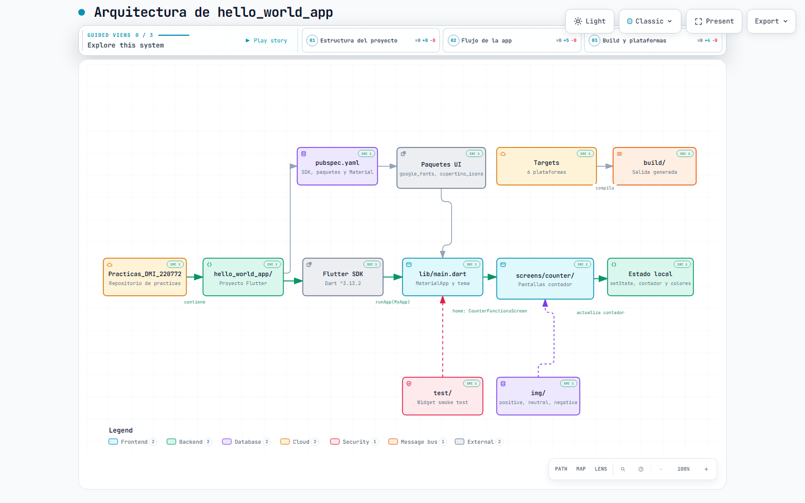
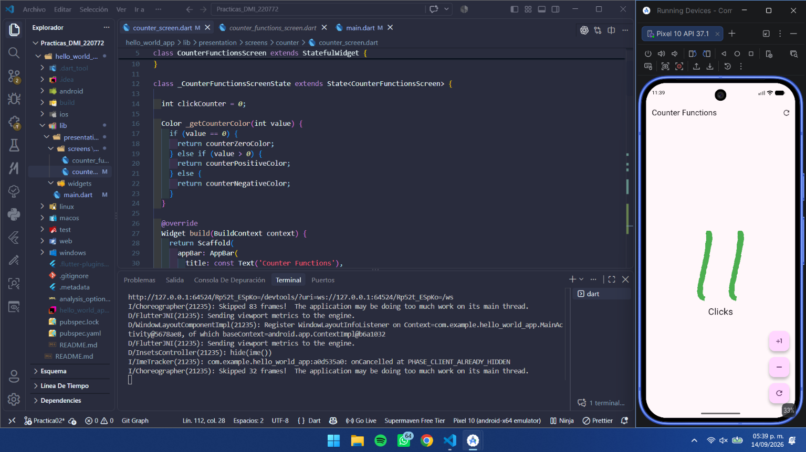
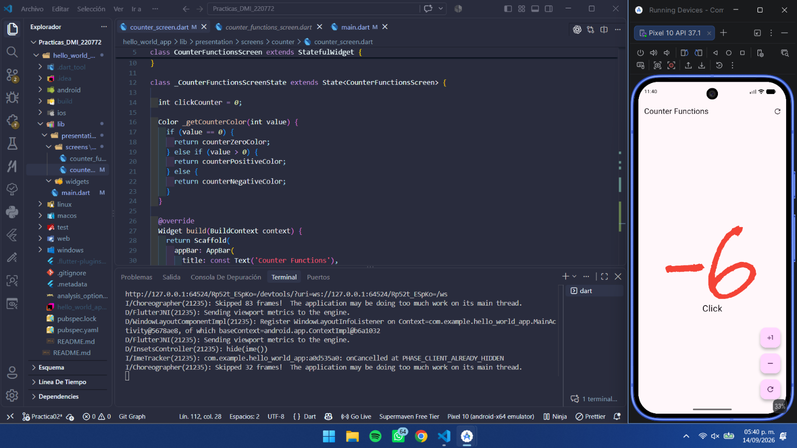

#  Prácticas de Desarrollo Móvil Integral (DMI)

## Información Académica

**Asignatura:** Desarrollo Móvil Integral (DMI)  
**Programa:** Ingeniería en Desarrollo y Gestión de Software  
**Docente:** M.T.I. Marco A. Ramírez Hernández  
**Período:** Septiembre - Diciembre 2026  
**Institución:** Universidad Tecnológica de Xicotepec de Juárez

---

<div align="center">

[](https://jesuuusart.github.io/Practicas_DMI_220772/)

  🔗 **[https://jesuuusart.github.io/Practicas_DMI_220772/](https://jesuuusart.github.io/Practicas_DMI_220772/)**
</div>

---

# Práctica #2: Contador Funcional con Flutter

## Información del Estudiante

- **Nombre:** Jesus Alejandro Artiaga Morales
- **Matrícula/ID:** 220772
- **Grado:** 10° A
- **Universidad:** Universidad Tecnológica de Xicotepec de Juárez
- **Carrera:** Ingeniería en Desarrollo y Gestión de Software
- **Materia:** Desarrollo Móvil Integral
- **Fecha de Entrega:** 2026-09-14

---

## Descripción del Proyecto

Este proyecto es una aplicación móvil desarrollada en **Flutter** que implementa un contador con funcionalidades básicas. La aplicación permite incrementar, decrementar y resetear un contador mediante botones flotantes. Es un ejemplo práctico de cómo utilizar widgets de Flutter, manejo de estado con `setState()`, y creación de widgets personalizados.

La aplicación demuestra conceptos fundamentales de desarrollo móvil como:
- Gestión de estado
- Uso de widgets
- Personalización de UI con colores dinámicos
- Extracción y reutilización de widgets

---

## Objetivo de la Práctica

El objetivo de esta práctica es:

1. **Aprender los fundamentos de Flutter** - Entender cómo funcionan los widgets y cómo se estructuran las aplicaciones móviles
2. **Implementar gestión de estado** - Utilizar `setState()` para actualizar la interfaz cuando cambia el contador
3. **Crear widgets personalizados** - Extraer y reutilizar componentes (CustomButton)
4. **Aplicar estilos y colores dinámicos** - Usar colores que cambien según el valor del contador
5. **Entender la arquitectura de carpetas** - Organizar el código de manera profesional

---

## 🏗️ Arquitectura del Proyecto

La arquitectura de `hello_world_app` está modelada en `Docs/Architecture/` con **OpenCode Archify**: diagramas HTML autónomos (SVG en línea, sin dependencias externas, modo claro/oscuro, zoom/pan y animación de trazado). Cada nodo del diagrama apunta al **archivo y línea reales del código**, por lo que la documentación no se desincroniza del proyecto.

### 📄 Artefactos Disponibles

| Artefacto | Descripción |
|---|---|
| **[hello_world_app_architecture.html](Docs/Architecture/hello_world_app_architecture.html)** | Diagrama de arquitectura: componentes, flujo de arranque, límites de confianza y vistas |
| **[hello_world_app_sequence.html](Docs/Architecture/hello_world_app_sequence.html)** | Diagrama de secuencia: qué ocurre exactamente en un toque al botón `+1` |
| [hello_world_app.architecture.json](Docs/Architecture/hello_world_app.architecture.json) | Fuente de datos del diagrama de arquitectura |
| [hello_world_app.sequence.json](Docs/Architecture/hello_world_app.sequence.json) | Fuente de datos del diagrama de secuencia |
| `*.visual-check.*.png` | Capturas de verificación visual (1440×900 y 2048×1320, claro y oscuro) |
| `*.visual-check.json` | Reporte de verificación: sin overflow, leyenda, dock de navegación y legibilidad de nodos ✅ |

### 🔀 Flujo de Componentes

```
                  ┌──────────────────────┐
                  │      Flutter SDK     │  Dart ^3.13.2
                  │   (pubspec.yaml:22)  │
                  └───────────┬──────────┘
                              │ runApp(MyApp)
                  ┌───────────▼──────────┐
      ┌───────────│      lib/main.dart   │───────────┐
      │           │   main() + MyApp     │           │ ThemeData
      │           │  (main.dart:9,13)    │           │ colorSchemeSeed magenta
      │           └───────────┬──────────┘           │
      │                       │ home:                │
      │                       │ CounterFunctionsScreen
      │           ┌───────────▼──────────────────┐    │
      │           │ CounterFunctionsScreen      │    │
      │           │ (counter_functions_screen   │    │
      │           │          .dart:5)            │    │
      │           └───────────┬──────────────────┘    │
      │                       │ createState()        │
      │           ┌───────────▼──────────┐           │
      │           │        State         │           │
      │           │ clickCounter + setState│─────────┼──┐
      │           │ (…screen.dart:12,14)  │           │  │
      │           └───────────┬──────────┘           │  │
      │                       │ setState() → build() │  │
      │           ┌───────────▼──────────┐           │  │
      │           │       build()        │           │  │
      │           │ Scaffold+AppBar+FAB  │           │  │
      │           │ (…screen.dart:27)    │           │  │
      │           └───────────┬──────────┘           │  │
      │                       │ 3 FAB en Column      │  │
      │           ┌───────────▼──────────┐   ┌───────▼──┐
      │           │    CustomButton      │   │ 3 consts │
      │           │ StatelessWidget →FAB │   │ zero/pos/ │
      │           │ (…screen.dart:99)    │   │ negative │
      │           └──────────────────────┘   │(main:5)  │
      │                                      └──────────┘
      │
      │  ┌──────────────────────┐
      └──┤   test/widget_test            │   smoke test: testWidgets + pumpWidget(MyApp)  (widget_test.dart:14,16)
         └──────────────────────┘

   dashed ──► main.dart ──► ThemeData ──► GoogleFonts.rockSalt (google_fonts ^7.0.0)
   solid   ──► flujo principal de arranque y renderizado
```

### 🧩 Componentes Mapeados

| Componente | Tipo | Responsabilidad | Ubicación |
|---|---|---|---|
| `Flutter SDK` | externo | Toolchain, `sdk: ^3.13.2` | `pubspec.yaml:22` |
| `lib/main.dart` | frontend | `main()` + `MyApp` (punto de entrada) | `lib/main.dart:9`, `lib/main.dart:13` |
| `CounterFunctionsScreen` | frontend | `StatefulWidget` activo de la app | `lib/presentation/screens/counter/counter_functions_screen.dart:5` |
| `State` | backend | `clickCounter` + `setState()` | `…/counter_functions_screen.dart:12`, `:14` |
| `build()` | frontend | `Scaffold` + `AppBar` + `floatingActionButton` | `…/counter_functions_screen.dart:27` |
| `ThemeData` | backend | `colorSchemeSeed` magenta `ARGB(255,208,33,243)` | `lib/main.dart:20` |
| `google_fonts` | externo | `GoogleFonts.rockSalt` (`^7.0.0`) | `pubspec.yaml:37` |
| `widget_test.dart` | seguridad | Smoke test: `testWidgets` + `pumpWidget(const MyApp())` | `test/widget_test.dart:14`, `:16` |
| `3 constantes` | datos | `counterZeroColor` / `Positive` / `Negative` | `lib/main.dart:5` |
| `CustomButton` | frontend | `StatelessWidget` que envuelve un FAB | `…/counter_functions_screen.dart:99` |

### 👁️ Vistas del Diagrama

El diagrama de arquitectura ofrece tres vistas filtradas que se seleccionan desde el dock inferior:

1. **Camino principal** — `flutterSdk → entrypoint → screen → state → uiBuild`: del arranque de Flutter al último rebuild que dispara un `setState()`.
2. **Tema y tipografía** — `entrypoint → theme → googleFonts`: `ThemeData` con `colorSchemeSeed` y la fuente Rock Salt.
3. **Estado, colores y pruebas** — `tests, entrypoint, screen, state, palette, customButton`: cómo el estado local alimenta el texto, los tres colores y los tres botones.

### 🔄 Secuencia de un Toque (`hello_world_app_sequence.html`)

| # | Participante | Mensaje | Notas |
|---|---|---|---|
| 1 | `Usuario` | toca el icono `plus_one` | punto de entrada externo |
| 2 | `CustomButton` | `onPressed()` | solo envuelve un FAB, recibe un `VoidCallback` y no guarda nada |
| 3 | `State` | `setState(): clickCounter += 1` | marca el `State` como sucio y agenda el siguiente frame |
| 4 | `build()` | `_getCounterColor(1)` | el `Scaffold` completo se reconstruye |
| 5 | `Color` | `1 > 0: elijo la positiva` | decisión con dos `if` y un `return` |
| 6 | `3 constantes` | `counterPositiveColor` | las constantes se importan desde `main.dart` |
| 7 | `google_fonts` | `rockSalt(160, w100, color)` | devuelve el `TextStyle` listo |
| 8 | `Frame` | `Text('$clickCounter')` con `Click` | pluralización solo si el valor supera 1 |
| 9 | `Usuario` | `1` en verde sobre la app | frame final pintado |

**Tarjetas de análisis del diagrama de secuencia:** *Toque y setState* (no hay `provider` ni estado global), *Decisión de color* (0 azul, >0 verde, <0 rojo), *Tipografía* (Rock Salt 160 pt `w100`), *Plural del Click* (con 0 y 1 se lee exactamente `Click`).

### 🔍 Hallazgos del Análisis

- `counter_screen.dart` nunca se importa desde ningún punto de entrada: es **código muerto** de la iteración anterior.
- `cupertino_icons` está declarado en `pubspec.yaml` pero no se usa en el código.
- El smoke test pulsa `Icons.add`, mientras la app usa `Icons.plus_one`.

---

## 📁 Estructura del Proyecto

```
hello_world_app/
├── lib/                                             # Código fuente Dart
│   ├── main.dart                                    # main(), MyApp, tema y 3 colores
│   └── presentation/
│       └── screens/
│           └── counter/
│               ├── counter_functions_screen.dart    # Pantalla activa (StatefulWidget + CustomButton)
│               └── counter_screen.dart               # Pantalla anterior, sin importar (código muerto)
├── test/
│   └── widget_test.dart                             # Smoke test
├── Docs/Architecture/                               # Diagramas Archify (HTML + JSON + PNG de verificación)
├── android/ ios/ web/ windows/ macos/ linux/         # Plataformas nativas
├── pubspec.yaml                                     # Dependencias (google_fonts ^7.0.0)
└── README.md                                        # Documentación principal
```

### Consistencia de la documentación

| Dato | Código real | README |
|---|---|---|
| Pantalla activa | `counter_functions_screen.dart` | ✅ documentada |
| `sdk` | `^3.13.2` | ✅ documentado |
| `google_fonts` | `^7.0.0` | ✅ documentado |
| `cupertino_icons` | `^1.0.8` | ✅ documentado |

---

## 🖼️ Vista Previa del Diagrama de Arquitectura (Archify)

#### Modo Claro (Light Mode)


#### Modo Oscuro (Dark Mode)


#### Resolución de escritorio compacto (1440×900)


---

## Principales Comandos de Flutter

### Comandos Básicos

```bash
# Instalar dependencias del proyecto
flutter pub get

# Ejecutar la aplicación en el emulador o dispositivo conectado
flutter run

# Ejecutar en modo debug con hot reload
flutter run -v

# Limpiar el proyecto (elimina carpeta build y caché)
flutter clean

# Ver dispositivos disponibles
flutter devices

# Detener la ejecución de la aplicación
# Presiona Ctrl+C en la terminal

# Hot Reload (durante ejecución)
# Presiona 'r' para recargar caliente
# Presiona 'R' para reiniciar la aplicación
```

### Comandos Avanzados

```bash
# Generar APK para Android
flutter build apk

# Generar app para iOS
flutter build ios

# Ejecutar tests
flutter test

# Verificar dependencias
flutter pub outdated

# Obtener información del proyecto
flutter doctor
```

---

## Widgets Utilizados

### 1. **Scaffold**
Widget principal que proporciona la estructura básica de la app (AppBar, Body, FloatingActionButton).

```dart
Scaffold(
  appBar: AppBar(...),
  body: Center(...),
  floatingActionButton: Column(...)
)
```

### 2. **AppBar**
Barra superior que contiene el título y acciones de la aplicación.

```dart
AppBar(
  title: const Text('Counter Functions'),
  actions: [
    IconButton(
      icon: Icon(Icons.refresh_rounded),
      onPressed: () { /* acción */ },
    ),
  ],
)
```

### 3. **Center**
Widget que centra sus hijos en la pantalla.

```dart
Center(
  child: Column(...) // Centra el contenido
)
```

### 4. **Column**
Organiza widgets en forma vertical (uno debajo del otro).

```dart
Column(
  mainAxisAlignment: MainAxisAlignment.center,
  children: [
    Text('Contador'),
    Text('Descripción'),
  ],
)
```

### 5. **Text**
Widget para mostrar texto en la pantalla.

```dart
Text(
  '$clickCounter',
  style: GoogleFonts.rockSalt(
    fontSize: 160,
    fontWeight: FontWeight.w100,
    color: _getCounterColor(clickCounter),
  ),
)
```

### 6. **FloatingActionButton**
Botón flotante redondo para acciones principales.

```dart
FloatingActionButton(
  onPressed: () { /* acción */ },
  child: Icon(Icons.plus_one),
)
```

### 7. **SizedBox**
Widget para agregar espaciado entre elementos.

```dart
SizedBox(height: 16) // Agrega 16 píxeles de altura
```

### 8. **IconButton**
Botón simple con icono para la AppBar.

```dart
IconButton(
  icon: Icon(Icons.refresh_rounded),
  onPressed: () { /* acción */ },
)
```

### 9. **CustomButton** (Widget Personalizado)
Widget creado en esta práctica que encapsula la lógica de un FloatingActionButton personalizado.

```dart
class CustomButton extends StatelessWidget {
  final IconData icon;
  final VoidCallback onPressed;

  const CustomButton({
    required this.icon,
    required this.onPressed,
  });

  @override
  Widget build(BuildContext context) {
    return FloatingActionButton(
      onPressed: onPressed,
      child: Icon(icon),
    );
  }
}
```

---

## Sistema de Colores

### Colores Definidos en `main.dart`

La aplicación utiliza un sistema de colores dinámicos que cambian según el valor del contador:

```dart
const Color counterZeroColor     = Color.fromARGB(255, 7, 164, 255);  // Azul (cuando contador = 0)
const Color counterPositiveColor = Colors.green;                     // Verde (cuando contador > 0)
const Color counterNegativeColor = Colors.red;                       // Rojo (cuando contador < 0)
```

### Implementación de Colores Dinámicos

Se utiliza el método `_getCounterColor()` para obtener el color apropiado:

```dart
Color _getCounterColor(int value) {
  if (value == 0) {
    return counterZeroColor;      // Azul
  } else if (value > 0) {
    return counterPositiveColor;  // Verde
  } else {
    return counterNegativeColor;  // Rojo
  }
}
```

Este método se aplica al widget Text que muestra el número:

```dart
Text(
  '$clickCounter',
  style: GoogleFonts.rockSalt(
    fontSize: 160,
    fontWeight: FontWeight.w100,
    color: _getCounterColor(clickCounter),  // Color dinámico
  ),
)
```

### Significado de los Colores
- 🔵 **Azul (0)** - Neutral, el contador está en cero
- 🟢 **Verde (>0)** - Positivo, se ha incrementado
- 🔴 **Rojo (<0)** - Negativo, se ha decrementado

---

## Funcionalidades Implementadas

### 1. **Botón Incrementar (+)**
- Aumenta el contador en 1
- Ícono: `Icons.plus_one`
- Acción: `clickCounter += 1`

### 2. **Botón Decrementar (-)**
- Disminuye el contador en 1
- Ícono: `Icons.remove`
- Implementado como `CustomButton`
- Acción: `clickCounter -= 1`

### 3. **Botón Resetear (↻)**
- Establece el contador en 0
- Ícono: `Icons.refresh_outlined`
- Acción: `clickCounter = 0`

### 4. **Indicador Textual**
- Muestra "Click" o "Clicks" según el valor
- Cambio dinámico: `Click${ clickCounter > 1 ? 's' : '' }`

### 5. **Cambio de Color Dinámico**
- El número cambia de color (azul → verde → rojo)
- Basado en el valor del contador

---

## Conceptos Clave Aprendidos

### Estado (State Management)
```dart
setState(() {
  clickCounter += 1;  // Actualiza el estado
});
```
Notifica a Flutter que debe reconstruir el widget con el nuevo valor.

### Widgets Stateless vs Stateful
- **StatefulWidget**: `CounterFunctionsScreen` - Puede cambiar su estado
- **StatelessWidget**: `CustomButton` - No cambia su estado interno

### Hot Reload
Permite ver cambios en el código sin reiniciar la aplicación completa, acelerando el desarrollo.

---

## Cómo Ejecutar la Aplicación

1. **Asegúrate de tener Flutter instalado:**
   ```bash
   flutter --version
   ```

2. **Navega a la carpeta del proyecto:**
   ```bash
   cd hello_world_app
   ```

3. **Instala las dependencias:**
   ```bash
   flutter pub get
   ```

4. **Ejecuta la aplicación:**
   ```bash
   flutter run
   ```

5. **Interactúa con los botones:**
   - Presiona el botón `+` para incrementar
   - Presiona el botón `-` para decrementar
   - Presiona el botón `↻` para resetear
   - Observa los cambios de color

---

## Conclusiones

Esta práctica permitió aprender:
- ✅ Estructura básica de una aplicación Flutter
- ✅ Cómo funcionan los widgets y su composición
- ✅ Gestión de estado con `setState()`
- ✅ Creación de widgets personalizados y reutilizables
- ✅ Uso de colores dinámicos basados en el estado
- ✅ Buenas prácticas en organización de código
- ✅ Importancia del Hot Reload en desarrollo móvil

---

## Dependencias Utilizadas

```yaml
environment:
  sdk: ^3.13.2

dependencies:
  flutter:
    sdk: flutter
  google_fonts: ^7.0.0    # Fuentes personalizadas (Rock Salt) — usada por MyApp y por la pantalla
  cupertino_icons: ^1.0.8 # Declarada pero no referenciada en el código

dev_dependencies:
  flutter_test:
    sdk: flutter
  flutter_lints: ^6.0.0
```

---

## 📊 Diagramas de Arquitectura Interactivos (Archify)

Abre los diagramas en cualquier navegador web. Son archivos HTML autónomos con SVG en línea, así que funcionan sin servidor y sin conexión:

- 🏗️ **[hello_world_app_architecture.html](Docs/Architecture/hello_world_app_architecture.html)** — Arquitectura: `flutterSdk → main.dart → CounterFunctionsScreen → State → build()`, más `ThemeData`, `google_fonts`, las 3 constantes de color, `CustomButton` y el smoke test.
- 🔄 **[hello_world_app_sequence.html](Docs/Architecture/hello_world_app_sequence.html)** — Secuencia de un toque: `+1` ➔ `onPressed()` ➔ `setState()` ➔ `_getCounterColor()` ➔ `GoogleFonts.rockSalt` ➔ frame pintado en verde.

### 🎬 Funcionalidades del Visualizador

- ☀️🌙 **Modo Claro y Modo Oscuro**: cambia el tema blueprint instantáneamente.
- 🖱️ **Pan & Zoom**: arrastre con el mouse y control de zoom (`PATH`, `MAP`, `LENS`, `-`, `+`).
- 🎯 **Vistas filtradas**: dock inferior con *Camino principal*, *Tema y tipografía* y *Estado, colores y pruebas*.
- 💻 **Paneles de código**: al hacer clic en un nodo se muestra la ruta del archivo, la línea y el fragmento Dart.
- 🎞️ **Trazado de flujo**: animación opcional que recorre las conexiones del diagrama.
- ✅ **Verificación visual** documentada en `hello_world_app_architecture.visual-check.json`: `status: pass`, sin desbordamiento horizontal ni vertical y con la leyenda y el dock de navegación siempre visibles.

---

## Evidencia / Capturas de Pantalla

### Estados del Contador

La aplicación muestra diferentes colores según el estado del contador, como se puede ver en las siguientes capturas:

#### 1. Contador en Neutral (0)
Cuando el contador tiene valor 0, el texto se muestra en **azul**.

.png)

---

#### 2. Contador Positivo
Cuando el contador tiene un valor mayor a 0, el texto se muestra en **verde**.



---

#### 3. Contador Negativo
Cuando el contador tiene un valor menor a 0, el texto se muestra en **rojo**.



---

## Notas Importantes

- La aplicación funciona en **Android**, **iOS**, **Web**, **Windows** y **macOS**
- Se utiliza el paquete `google_fonts` para la fuente personalizada "Rock Salt"
- El contador puede ser positivo, negativo o cero
- Los botones se organizan verticalmente con espaciado usando `SizedBox`
- El AppBar contiene un botón de reset adicional

---

**Fecha de Elaboración:** 14 de Septiembre 2026  
**Profesor/Evaluador:** Marco Antonio Ramirez Hernandez 
**Estado:** Completado ✅
