# Práctica 04 — TokTik

> App de videos de estilo **TikTok** con scroll vertical y reproducción continua, construida con Flutter.
> Incluye **selector automático de tema por fecha** (principal, Halloween y Navidad) y cambio de icono según la temporada.

- **Estudiante:** Jesus Alejandro Artiaga Morales
- **Matrícula:** 220772 (10º A)
- **Materia:** Desarrollo Móvil Integral (DMI)
- **Docente:** M.T.I. Marco A. Rentería Hernández
- **Periodo:** Septiembre — Diciembre 2026

---

<div align="center">

[](https://jesuuusart.github.io/Practicas_DMI_220772/)

  🔗 **[https://jesuuusart.github.io/Practicas_DMI_220772/](https://jesuuusart.github.io/Practicas_DMI_220772/)**
</div>

---

## 1. Objetivo de la práctica

Construir una aplicación móvil con Flutter que reproduzca la experiencia de un feed de video corto
estilo TikTok, aplicando la capa de datos, provider para estado, manejo de videos con `video_player`,
y una funcionalidad extra de **temas por temporada** con cambio de fuente, paleta e icono, más un
**filtro de videos** por vistas vs likes.

### Objetivos específicos

1. Listar videos destacados de forma local sincronizada con assets.
2. Implementar scroll vertical tipo TikTok con videos a pantalla completa.
3. Reproducir cada video con el paquete `video_player` y sus dependencias.
4. Filtrar y ocultar los videos que tengan menos vistas que likes.
5. Implementar un tema por temporada (principal, Halloween y Navidad) con fuentes personalizadas
   usando Poppins, Creepster y Mountains of Christmas.
6. Cambiar automáticamente el tema y el icono de la app según la fecha del dispositivo.
7. Documentar el proyecto con diagramas de arquitectura interactivos (Archify) y evidencias.

---

## 2. Tecnologías utilizadas

| Tecnología | Versión | Para qué se usa |
|:---|:---|:---|
| **Flutter** | `3.47.2` (stable) | Framework de interfaz multiplataforma. |
| **Dart** | `3.13.2` (stable) | Lenguaje de programación. |
| **provider** | `^6.1.5+1` | Manejo de estado con ChangeNotifier. |
| **video_player** | `^2.10.0` | Reproducción de videos a pantalla completa. |
| **animate_do** | `^4.0.0` | Animaciones de los botones de interacción. |
| **intl** | `^0.20.2` | Formato compacto de likes / vistas (23.2K). |
| **Archify** | Skill local | Generación de diagramas interactivos con modo claro y oscuro. |

---

## 3. Diagramas de arquitectura (Archify)

🌐 [Ver el diagrama dinámico en GitHub Pages](https://jesuuusart.github.io/Practicas_DMI_220772/Practica04/toktik/Docs/Architecture/toktik_architecture.html)

<a href="https://jesuuusart.github.io/Practicas_DMI_220772/Practica04/toktik/Docs/Architecture/toktik_architecture.html">
  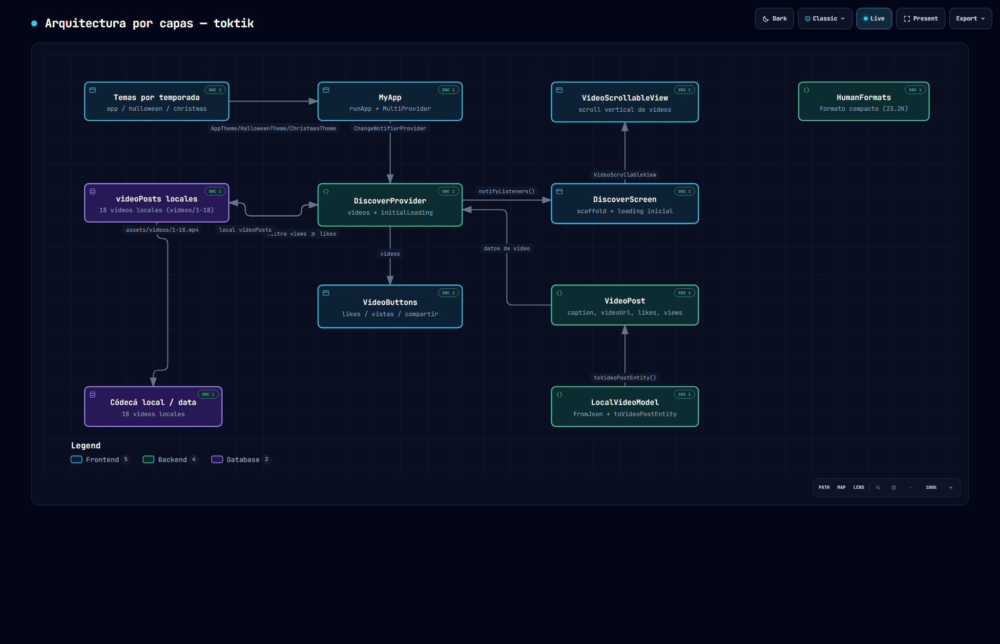
  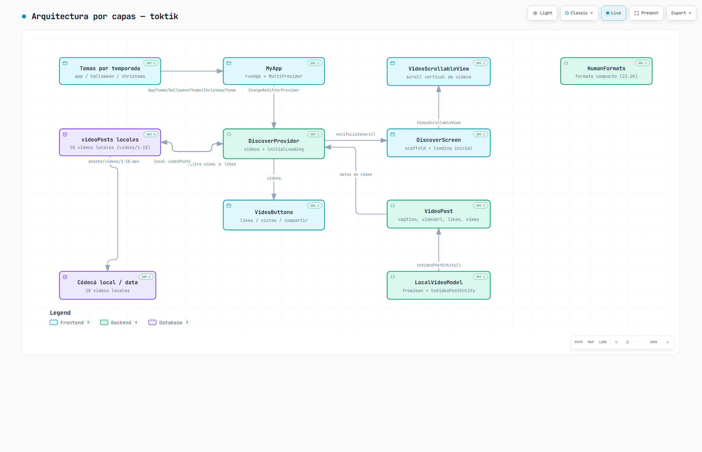
</a>

---

## 4. Evidencias de la aplicación

### Tema principal

<p align="center">
  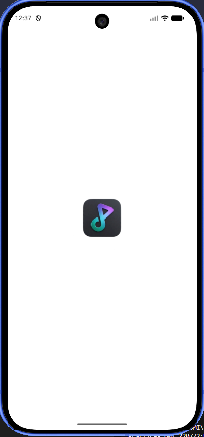
  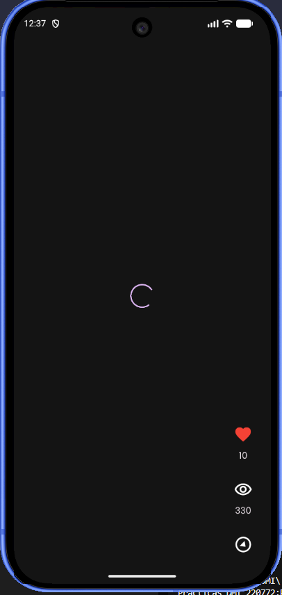
  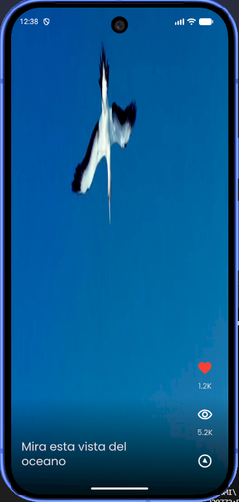
  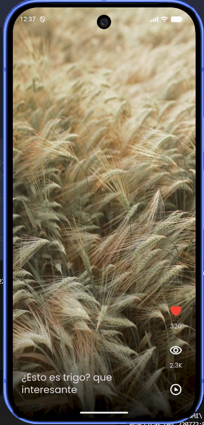
</p>

### Tema Halloween

<p align="center">
  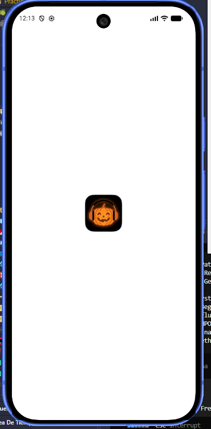
  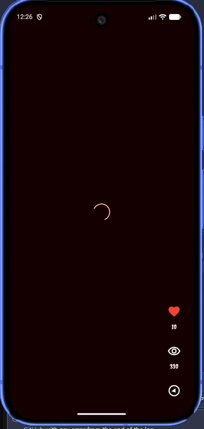
  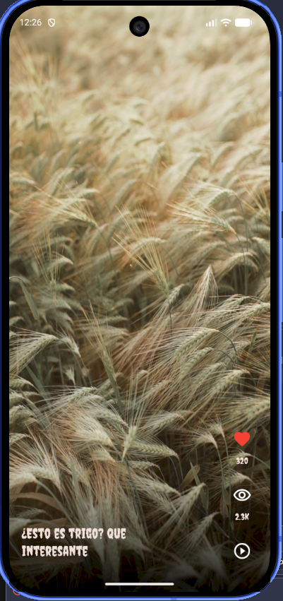
  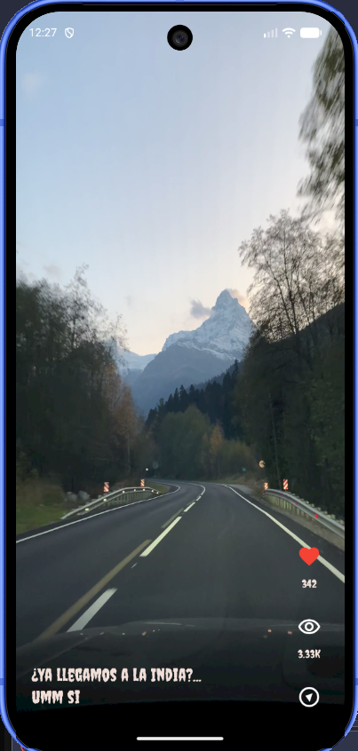
</p>

### Tema Navidad

<p align="center">
  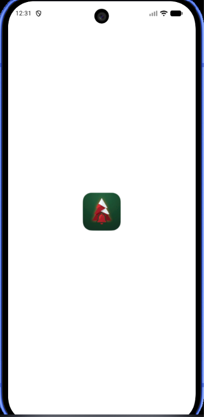
  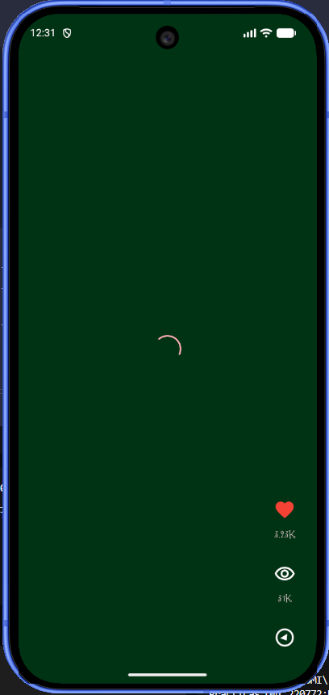
  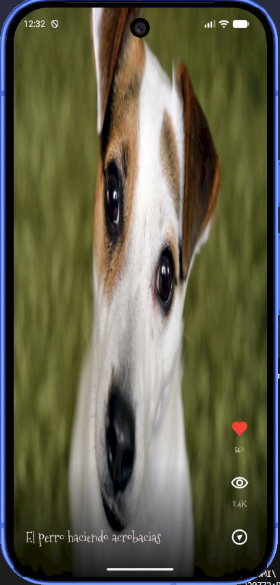
  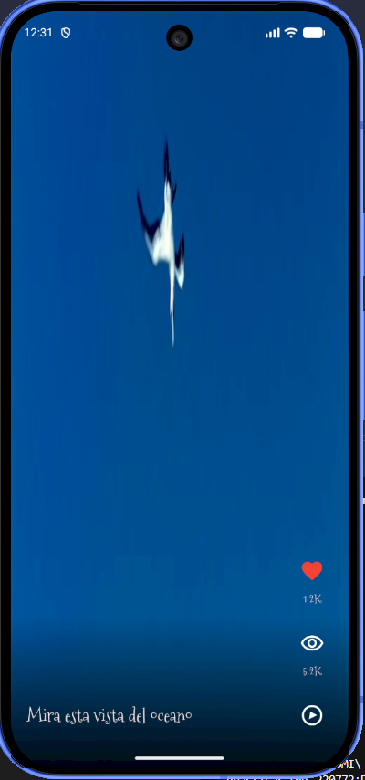
</p>


---

## 5. Cómo ejecutarlo

### Requisitos previos

- **Flutter SDK** `3.47.2` o superior (`flutter --version` para verificarlo).
- **Android SDK** o un emulador ya creado.
- Utilidad de render: el tema aplica solo en dispositivo/emulador Android o Web.

### Comandos

```bash
flutter pub get
flutter analyze      # solo el warning heredado de fullscreen_player
flutter run          # en un emulador o dispositivo
```
