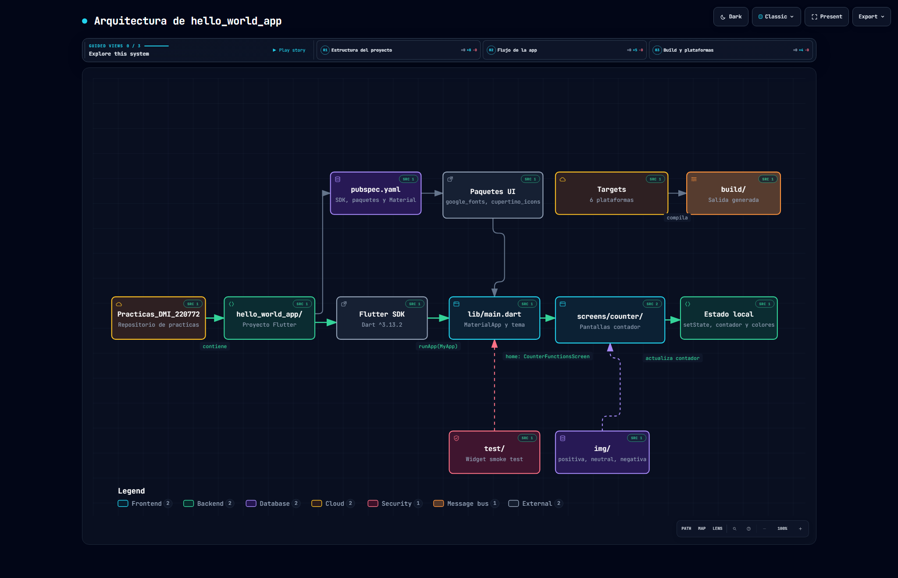
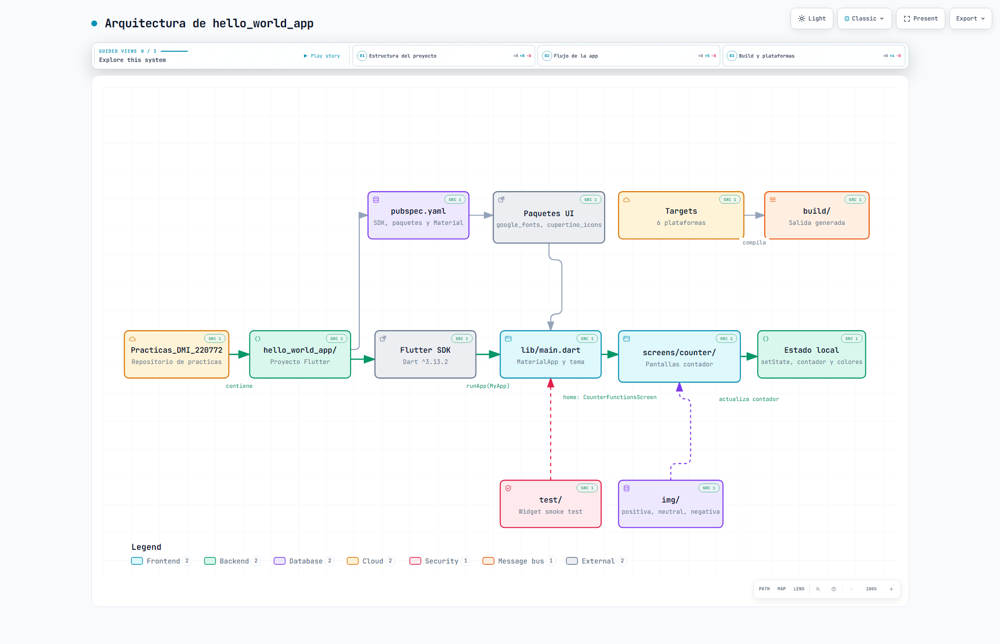

  

  # Prácticas de la Asignatura de Desarrollo Móvil Integral

  ## Ingeniería en Desarrollo y Gestión de Software

  **Estudiante:** Jesus Alejandro Artiaga Morales (Matrícula: 220772)  
  **Docente:** M.T.I. Marco A. Ramírez Hernández  
  **Periodo:** Septiembre - Diciembre 2026  

---

### 📋 Tabla de Prácticas de la Materia

| No. | Nombre | Descripción | Potenciador | Estatus |
|:---:|:---|:---|:---:|:---:|
| 1. | Metodología de Evaluación de la Materia | Transcribir en libreta y comprender la metodología y fechas de evaluación de la asignatura | 5 | 🟢 Concluida |
| 2. | Mi Primer Aplicación Móvil con Flutter | Codificar la app móvil en el framework de Flutter manejando Stateless y Stateful Widgets | 25 | 🟢 Concluida |

---

### 📂 Proyectos y Diagramas de Arquitectura

- **[📱 hello_world_app](hello_world_app/)** — Contador Funcional en Flutter ([📄 Documentación completa](hello_world_app/README.md))

  
<b>🌐 Ver Diagramas de Arquitectura Archify (Haz clic para desplegar)</b>

   

  #### 🔗 Enlaces a Diagramas Interactivos:
  - 🌐 [Diagrama Nativo OpenCode Archify](hello_world_app/Docs/Architecture/hello_world_app_architecture.html)
  - 🏗️ [Visualizador Archify Completo (archify_diagram.html)](archify_diagram.html)
  - 🖥️ [Visualizador Principal (index.html)](index.html)

  #### 🖼️ Previsualización de Diagrama:
  | Modo Oscuro (Dark) | Modo Claro (Light) |
  |---|---|
  |  |  |

