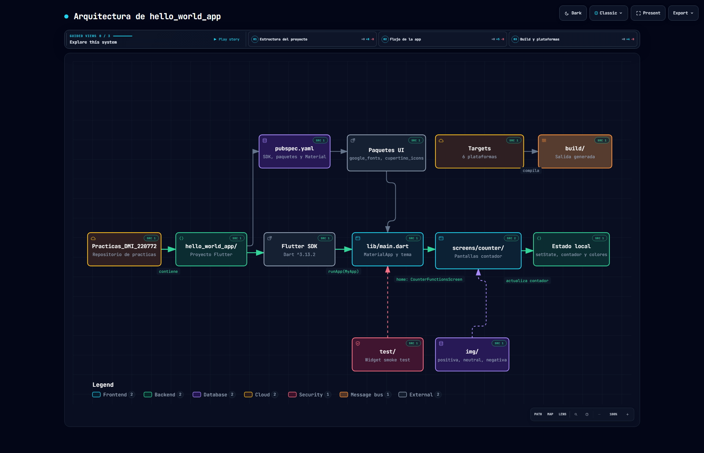
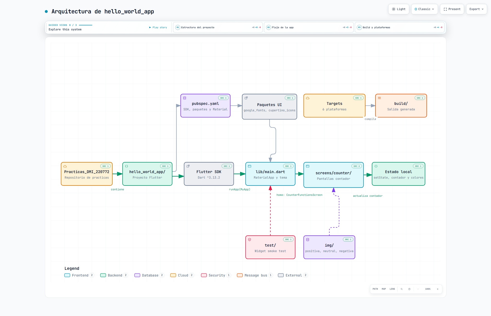
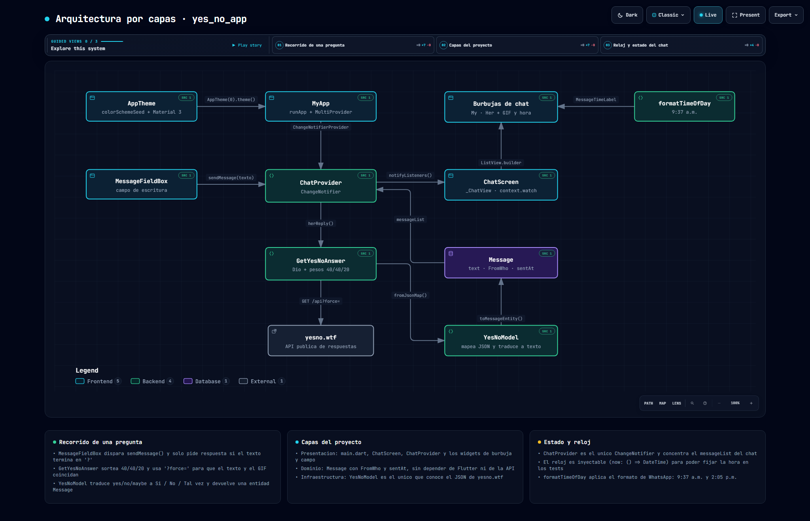
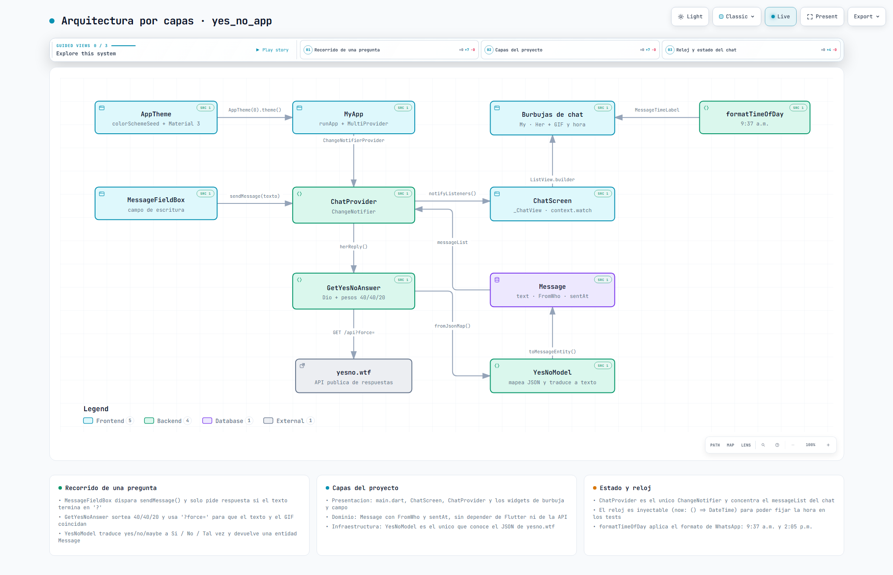

  

  # Prácticas de la Asignatura de Desarrollo Móvil Integral

  ## Ingeniería en Desarrollo y Gestión de Software

  **Estudiante:** Jesus Alejandro Artiaga Morales (Matrícula: 220772)  
  **Docente:** M.T.I. Marco A. Ramírez Hernández  
  **Periodo:** Septiembre - Diciembre 2026  

  

  🔗 **[https://jesuuusart.github.io/Practicas_DMI_220772/](https://jesuuusart.github.io/Practicas_DMI_220772/)**

---

### 📋 Tabla de Prácticas de la Materia

| No. | Nombre | Descripción | Potenciador | Estatus |
|:---:|:---|:---|:---:|:---:|
| 1. | Metodología de Evaluación de la Materia | Transcribir en libreta y comprender la metodología y fechas de evaluación de la asignatura | 5 | 🟢 Concluida |
| 2. | [Mi Primer Aplicación Móvil con Flutter](/Practica02/hello_world_app) | Codificar la app móvil en el framework de Flutter manejando Stateless y Stateful Widgets | 25 | 🟢 Concluida |
| 3. | [Yes No Maybe App](/Practica03/yes_no_app) | App de chat en Flutter que consulta la API yesno.wtf con arquitectura por capas, inyección de dependencias, 38 pruebas y 4 diagramas Archify | 30 | 🟢 Concluida |

---

### 📂 Proyectos y Diagramas de Arquitectura

- **[📱 hello_world_app](Practica02/hello_world_app/)** — Contador Funcional en Flutter ([📄 Documentación completa](Practica02/hello_world_app/README.md))
- **[💬 yes_no_app](Practica03/yes_no_app/)** — Yes No Maybe App en Flutter ([📄 Documentación completa](Practica03/yes_no_app/README.md))

  
<b>🌐 Ver Diagramas de Arquitectura Archify (Haz clic para desplegar)</b>

   

  #### 🔗 Enlaces a Diagramas Interactivos:
  - 🌐 [Sitio Web Portafolio GitHub Pages](https://jesuuusart.github.io/Practicas_DMI_220772/)
  - 🌐 [Diagrama Nativo OpenCode Archify](Practica02/hello_world_app/Docs/Architecture/hello_world_app_architecture.html)
  - 🖥️ [Visualizador Principal (index.html)](index.html)

  #### 🖼️ Previsualización de Diagrama:
  | Modo Oscuro (Dark) | Modo Claro (Light) |
  |---|---|
  |  |  |

  
<b>💬 Yes No Maybe App — 4 Diagramas Archify (Haz clic para desplegar)</b>

   

  #### 🔗 Enlaces a Diagramas Interactivos:
  - 🏗️ [Arquitectura por capas](Practica03/yes_no_app/Docs/Architecture/yes_no_app_architecture.visual-check.1440x900.dark.png)
  - 🔄 [Secuencia de una respuesta](Practica03/yes_no_app/Docs/Architecture/yes_no_app_sequence.visual-check.1440x900.dark.png)
  - 🔁 [Ciclo de vida de un mensaje](Practica03/yes_no_app/Docs/Architecture/yes_no_app_lifecycle.visual-check.1440x900.dark.png)
  - 🧪 [Estrategia de pruebas](Practica03/yes_no_app/Docs/Architecture/yes_no_app_tests.visual-check.1440x900.dark.png)
  - 🌐 [Versión en GitHub Pages](https://jesuuusart.github.io/Practicas_DMI_220772/Practica03/yes_no_app/Docs/Architecture/yes_no_app_architecture.html)

  #### 🖼️ Previsualización del Diagrama de Arquitectura:
  | Modo Oscuro (Dark) | Modo Claro (Light) |
  |---|---|
  |  |  |

