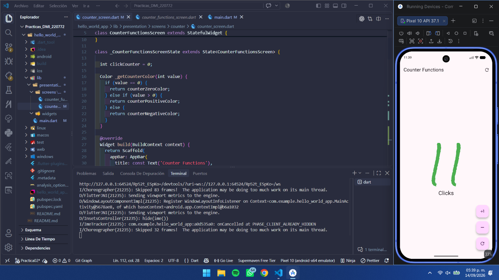
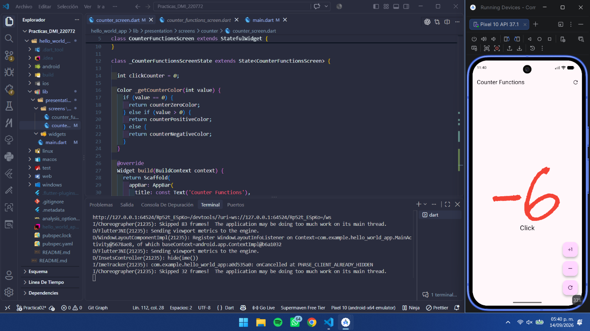

# Práctica de Desarrollo Móvil Integral - Contador Funcional

## Información del Estudiante
- **Nombre:** Jesus Alejandro Artiaga Morales
- **Universidad:** Universidad Tecnológica de Xicotepec de Juárez
- **Grado:** 10° A
- **Materia:** Desarrollo Móvil Integral (DMI)
- **Fecha:** 2026

---

## Descripción del Proyecto

Este proyecto es una aplicación móvil desarrollada en **Flutter** que implementa un contador con funcionalidades básicas. La aplicación permite incrementar, decrementar y resetear un contador mediante botones flotantes. Es un ejemplo práctico de cómo utilizar widgets de Flutter, manejo de estado con `setState()`, y creación de widgets personalizados.

La aplicación demuestra conceptos fundamentales de desarrollo móvil como:
- Gestión de estado
- Uso de widgets
- Personalización de UI con colores dinámicos
- Extracción y reutilización de widgets

---

## Objetivo de la Práctica

El objetivo de esta práctica es:

1. **Aprender los fundamentos de Flutter** - Entender cómo funcionan los widgets y cómo se estructuran las aplicaciones móviles
2. **Implementar gestión de estado** - Utilizar `setState()` para actualizar la interfaz cuando cambia el contador
3. **Crear widgets personalizados** - Extraer y reutilizar componentes (CustomButton)
4. **Aplicar estilos y colores dinámicos** - Usar colores que cambien según el valor del contador
5. **Entender la arquitectura de carpetas** - Organizar el código de manera profesional

---

## Principales Comandos de Flutter

### Comandos Básicos

```bash
# Instalar dependencias del proyecto
flutter pub get

# Ejecutar la aplicación en el emulador o dispositivo conectado
flutter run

# Ejecutar en modo debug con hot reload
flutter run -v

# Limpiar el proyecto (elimina carpeta build y caché)
flutter clean

# Ver dispositivos disponibles
flutter devices

# Detener la ejecución de la aplicación
# Presiona Ctrl+C en la terminal

# Hot Reload (durante ejecución)
# Presiona 'r' para recargar caliente
# Presiona 'R' para reiniciar la aplicación
```

### Comandos Avanzados

```bash
# Generar APK para Android
flutter build apk

# Generar app para iOS
flutter build ios

# Ejecutar tests
flutter test

# Verificar dependencias
flutter pub outdated

# Obtener información del proyecto
flutter doctor
```

---

## Widgets Utilizados

### 1. **Scaffold**
Widget principal que proporciona la estructura básica de la app (AppBar, Body, FloatingActionButton).

```dart
Scaffold(
  appBar: AppBar(...),
  body: Center(...),
  floatingActionButton: Column(...)
)
```

### 2. **AppBar**
Barra superior que contiene el título y acciones de la aplicación.

```dart
AppBar(
  title: const Text('Counter Functions'),
  actions: [
    IconButton(
      icon: Icon(Icons.refresh_rounded),
      onPressed: () { /* acción */ },
    ),
  ],
)
```

### 3. **Center**
Widget que centra sus hijos en la pantalla.

```dart
Center(
  child: Column(...) // Centra el contenido
)
```

### 4. **Column**
Organiza widgets en forma vertical (uno debajo del otro).

```dart
Column(
  mainAxisAlignment: MainAxisAlignment.center,
  children: [
    Text('Contador'),
    Text('Descripción'),
  ],
)
```

### 5. **Text**
Widget para mostrar texto en la pantalla.

```dart
Text(
  '$clickCounter',
  style: GoogleFonts.rockSalt(
    fontSize: 160,
    fontWeight: FontWeight.w100,
    color: _getCounterColor(clickCounter),
  ),
)
```

### 6. **FloatingActionButton**
Botón flotante redondo para acciones principales.

```dart
FloatingActionButton(
  onPressed: () { /* acción */ },
  child: Icon(Icons.plus_one),
)
```

### 7. **SizedBox**
Widget para agregar espaciado entre elementos.

```dart
SizedBox(height: 16) // Agrega 16 píxeles de altura
```

### 8. **IconButton**
Botón simple con icono para la AppBar.

```dart
IconButton(
  icon: Icon(Icons.refresh_rounded),
  onPressed: () { /* acción */ },
)
```

### 9. **CustomButton** (Widget Personalizado)
Widget creado en esta práctica que encapsula la lógica de un FloatingActionButton personalizado.

```dart
class CustomButton extends StatelessWidget {
  final IconData icon;
  final VoidCallback onPressed;

  const CustomButton({
    required this.icon,
    required this.onPressed,
  });

  @override
  Widget build(BuildContext context) {
    return FloatingActionButton(
      onPressed: onPressed,
      child: Icon(icon),
    );
  }
}
```

---

## Sistema de Colores

### Colores Definidos en `main.dart`

La aplicación utiliza un sistema de colores dinámicos que cambian según el valor del contador:

```dart
const Color counterZeroColor = Color.fromARGB(255, 110, 124, 207);    // Azul (cuando contador = 0)
const Color counterPositiveColor = Color.fromARGB(255, 49, 202, 100);  // Verde (cuando contador > 0)
const Color counterNegativeColor = Color.fromARGB(255, 219, 62, 62);   // Rojo (cuando contador < 0)
```

### Implementación de Colores Dinámicos

Se utiliza el método `_getCounterColor()` para obtener el color apropiado:

```dart
Color _getCounterColor(int value) {
  if (value == 0) {
    return counterZeroColor;      // Azul
  } else if (value > 0) {
    return counterPositiveColor;  // Verde
  } else {
    return counterNegativeColor;  // Rojo
  }
}
```

Este método se aplica al widget Text que muestra el número:

```dart
Text(
  '$clickCounter',
  style: GoogleFonts.rockSalt(
    fontSize: 160,
    fontWeight: FontWeight.w100,
    color: _getCounterColor(clickCounter),  // Color dinámico
  ),
)
```

### Significado de los Colores
- 🔵 **Azul (0)** - Neutral, el contador está en cero
- 🟢 **Verde (>0)** - Positivo, se ha incrementado
- 🔴 **Rojo (<0)** - Negativo, se ha decrementado

---

## Estructura del Proyecto

```
hello_world_app/
├── lib/
│   ├── main.dart                              # Punto de entrada + colores
│   └── presentation/
│       └── screens/
│           └── counter/
│               └── counter_screen.dart        # Pantalla principal + CustomButton
├── pubspec.yaml                               # Dependencias
└── android/, ios/, web/, windows/, macos/     # Plataformas específicas
```

---

## Funcionalidades Implementadas

### 1. **Botón Incrementar (+)**
- Aumenta el contador en 1
- Ícono: `Icons.plus_one`
- Acción: `clickCounter += 1`

### 2. **Botón Decrementar (-)**
- Disminuye el contador en 1
- Ícono: `Icons.remove`
- Implementado como `CustomButton`
- Acción: `clickCounter -= 1`

### 3. **Botón Resetear (↻)**
- Establece el contador en 0
- Ícono: `Icons.refresh_outlined`
- Acción: `clickCounter = 0`

### 4. **Indicador Textual**
- Muestra "Click" o "Clicks" según el valor
- Cambio dinámico: `Click${ clickCounter > 1 ? 's' : '' }`

### 5. **Cambio de Color Dinámico**
- El número cambia de color (azul → verde → rojo)
- Basado en el valor del contador

---

## Conceptos Clave Aprendidos

### Estado (State Management)
```dart
setState(() {
  clickCounter += 1;  // Actualiza el estado
});
```
Notifica a Flutter que debe reconstruir el widget con el nuevo valor.

### Widgets Stateless vs Stateful
- **StatefulWidget**: `CounterFunctionsScreen` - Puede cambiar su estado
- **StatelessWidget**: `CustomButton` - No cambia su estado interno

### Hot Reload
Permite ver cambios en el código sin reiniciar la aplicación completa, acelerando el desarrollo.

---

## Cómo Ejecutar la Aplicación

1. **Asegúrate de tener Flutter instalado:**
   ```bash
   flutter --version
   ```

2. **Navega a la carpeta del proyecto:**
   ```bash
   cd hello_world_app
   ```

3. **Instala las dependencias:**
   ```bash
   flutter pub get
   ```

4. **Ejecuta la aplicación:**
   ```bash
   flutter run
   ```

5. **Interactúa con los botones:**
   - Presiona el botón `+` para incrementar
   - Presiona el botón `-` para decrementar
   - Presiona el botón `↻` para resetear
   - Observa los cambios de color

---

## Conclusiones

Esta práctica permitió aprender:
- ✅ Estructura básica de una aplicación Flutter
- ✅ Cómo funcionan los widgets y su composición
- ✅ Gestión de estado con `setState()`
- ✅ Creación de widgets personalizados y reutilizables
- ✅ Uso de colores dinámicos basados en el estado
- ✅ Buenas prácticas en organización de código
- ✅ Importancia del Hot Reload en desarrollo móvil

---

## Dependencias Utilizadas

```yaml
dependencies:
  flutter:
    sdk: flutter
  google_fonts: ^6.2.1  # Fuentes personalizadas (Rock Salt)
  cupertino_icons: ^1.0.2
```

---

## Evidencia / Capturas de Pantalla

### Estados del Contador

La aplicación muestra diferentes colores según el estado del contador, como se puede ver en las siguientes capturas:

#### 1. Contador en Neutral (0)
Cuando el contador tiene valor 0, el texto se muestra en **azul**.

.png)

---

#### 2. Contador Positivo
Cuando el contador tiene un valor mayor a 0, el texto se muestra en **verde**.



---

#### 3. Contador Negativo
Cuando el contador tiene un valor menor a 0, el texto se muestra en **rojo**.



---

## Notas Importantes

- La aplicación funciona en **Android**, **iOS**, **Web**, **Windows** y **macOS**
- Se utiliza el paquete `google_fonts` para la fuente personalizada "Rock Salt"
- El contador puede ser positivo, negativo o cero
- Los botones se organizan verticalmente con espaciado usando `SizedBox`
- El AppBar contiene un botón de reset adicional

---

**Fecha de Elaboración:** 14 de Septiembre 2026  
**Profesor/Evaluador:** Marco Antonio Ramirez Hernandez 
**Estado:** Completado ✅
